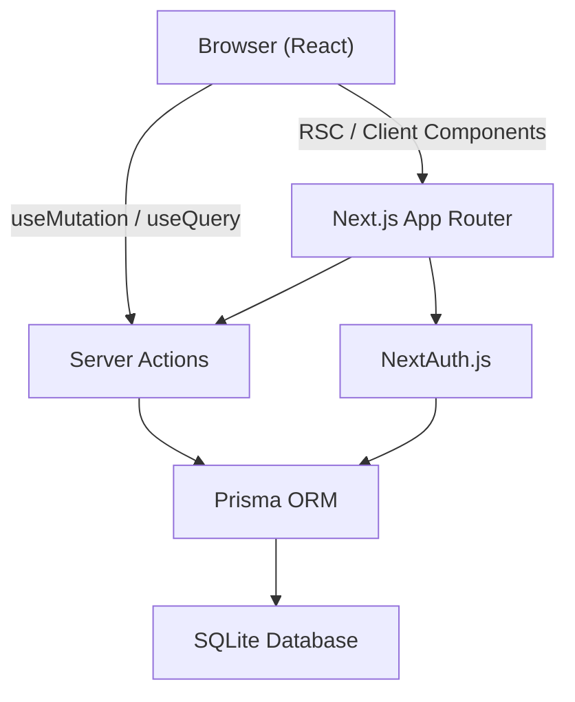
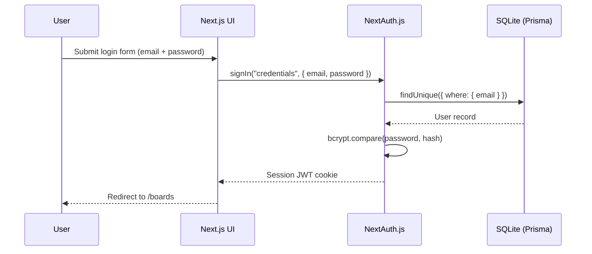
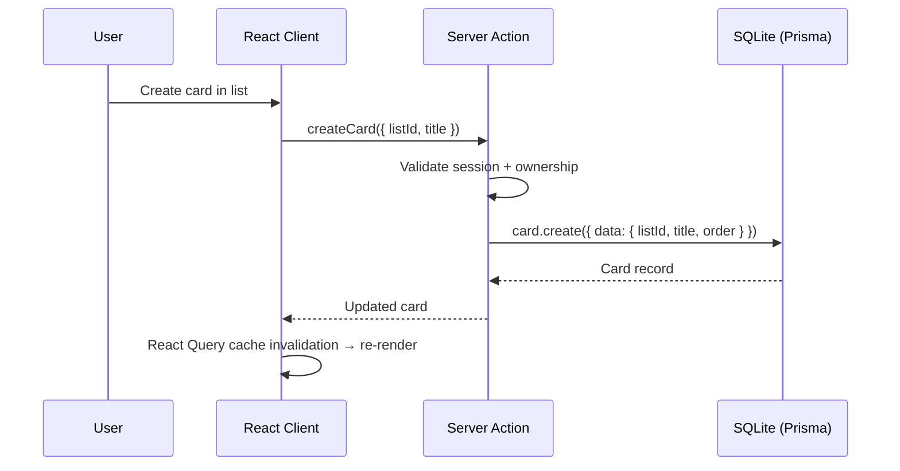
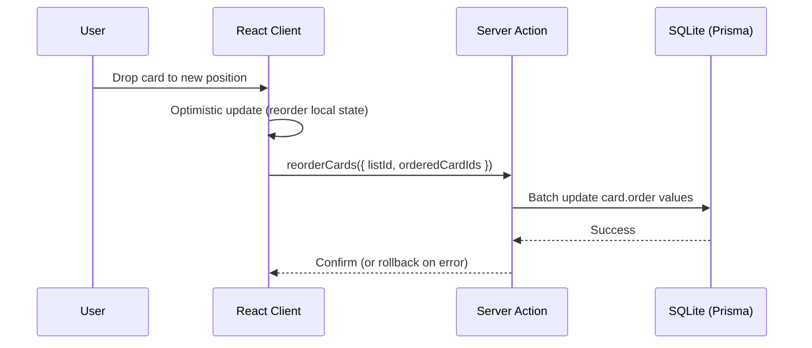

# Design Document: Trello-Lite

## Overview

Trello-Lite is a lightweight task creation and tracking web application built with Next.js. It provides the core Trello experience: authenticated users can create boards, organize lists (columns) within boards, and manage cards within lists. Cards support drag-and-drop reordering, due dates, labels, and descriptions.

The stack is: Next.js 14 (App Router), SQLite via Prisma ORM, NextAuth.js for authentication, Tailwind CSS + shadcn/ui for the UI, and Next.js Server Actions with React Query for data mutations and fetching.

## Architecture




## Sequence Diagrams

### User Authentication Flow



### Board & Card Operations Flow



### Drag & Drop Reorder Flow




## Components and Interfaces

### Component: BoardList

**Purpose**: Displays all boards owned by the authenticated user on the `/boards` dashboard.

**Interface**:
```typescript
interface BoardListProps {
  userId: string
}

// Fetches boards server-side via RSC, renders <BoardCard> for each
function BoardList({ userId }: BoardListProps): JSX.Element
```

**Responsibilities**:
- Fetch boards for the current user
- Render a grid of board cards
- Provide a "Create Board" button that opens a modal

---

### Component: BoardView

**Purpose**: The main board page at `/boards/[boardId]`. Renders all lists and their cards.

**Interface**:
```typescript
interface BoardViewProps {
  boardId: string
}

function BoardView({ boardId }: BoardViewProps): JSX.Element
```

**Responsibilities**:
- Fetch board with nested lists and cards (ordered by `order` field)
- Render `<ListColumn>` for each list
- Provide drag-and-drop context (via `@hello-pangea/dnd`)
- Handle cross-list card moves and within-list reordering

---

### Component: ListColumn

**Purpose**: A single Trello column containing an ordered list of cards.

**Interface**:
```typescript
interface ListColumnProps {
  list: ListWithCards  // List & { cards: Card[] }
  boardId: string
}

function ListColumn({ list, boardId }: ListColumnProps): JSX.Element
```

**Responsibilities**:
- Render list title (inline editable)
- Render `<CardItem>` for each card
- Provide "Add a card" inline form
- Accept drag-and-drop droppable zone

---

### Component: CardItem

**Purpose**: A single draggable card within a list.

**Interface**:
```typescript
interface CardItemProps {
  card: Card
  index: number
}

function CardItem({ card, index }: CardItemProps): JSX.Element
```

**Responsibilities**:
- Display card title, labels, and due date badge
- Open `<CardModal>` on click
- Act as a draggable item

---

### Component: CardModal

**Purpose**: Full card detail view in a modal dialog.

**Interface**:
```typescript
interface CardModalProps {
  cardId: string
  onClose: () => void
}

function CardModal({ cardId, onClose }: CardModalProps): JSX.Element
```

**Responsibilities**:
- Display and edit card title, description, due date, labels
- Trigger server actions for updates
- Delete card


## Data Models

### Prisma Schema

```prisma
model User {
  id        String   @id @default(cuid())
  email     String   @unique
  name      String?
  password  String   // bcrypt hash
  boards    Board[]
  createdAt DateTime @default(now())
}

model Board {
  id        String   @id @default(cuid())
  title     String
  color     String   @default("#0079BF")  // background color
  userId    String
  user      User     @relation(fields: [userId], references: [id], onDelete: Cascade)
  lists     List[]
  createdAt DateTime @default(now())
  updatedAt DateTime @updatedAt
}

model List {
  id        String   @id @default(cuid())
  title     String
  order     Int      // position within board
  boardId   String
  board     Board    @relation(fields: [boardId], references: [id], onDelete: Cascade)
  cards     Card[]
  createdAt DateTime @default(now())
  updatedAt DateTime @updatedAt
}

model Card {
  id          String    @id @default(cuid())
  title       String
  description String?
  order       Int       // position within list
  dueDate     DateTime?
  listId      String
  list        List      @relation(fields: [listId], references: [id], onDelete: Cascade)
  labels      Label[]
  createdAt   DateTime  @default(now())
  updatedAt   DateTime  @updatedAt
}

model Label {
  id     String @id @default(cuid())
  name   String
  color  String // hex color
  cardId String
  card   Card   @relation(fields: [cardId], references: [id], onDelete: Cascade)
}
```

**Validation Rules**:
- `Board.title`: non-empty, max 100 chars
- `List.title`: non-empty, max 100 chars
- `Card.title`: non-empty, max 255 chars
- `Card.order` and `List.order`: non-negative integers, unique within parent
- `Label.color`: valid hex color string (#RRGGBB)
- `User.email`: valid email format, unique


## Algorithmic Pseudocode

### Algorithm: reorderCards

Handles card reordering after a drag-and-drop event. Supports both within-list and cross-list moves.

```pascal
PROCEDURE reorderCards(dragResult)
  INPUT: dragResult (source: { listId, index }, destination: { listId, index }, cardId)
  OUTPUT: void (mutates DB, triggers cache invalidation)

  IF destination IS NULL THEN
    RETURN  // dropped outside a valid zone
  END IF

  IF source.listId EQUALS destination.listId THEN
    // Within-list reorder
    cards ← getCardsForList(source.listId)
    cards ← removeAt(cards, source.index)
    cards ← insertAt(cards, destination.index, cardId)
    FOR i FROM 0 TO cards.length - 1 DO
      ASSERT cards[i].order = i  // loop invariant: order matches index
      updateCardOrder(cards[i].id, i)
    END FOR
  ELSE
    // Cross-list move
    sourceCards ← getCardsForList(source.listId)
    destCards   ← getCardsForList(destination.listId)

    sourceCards ← removeAt(sourceCards, source.index)
    destCards   ← insertAt(destCards, destination.index, cardId)

    updateCardList(cardId, destination.listId)

    FOR i FROM 0 TO sourceCards.length - 1 DO
      updateCardOrder(sourceCards[i].id, i)
    END FOR
    FOR i FROM 0 TO destCards.length - 1 DO
      updateCardOrder(destCards[i].id, i)
    END FOR
  END IF
END PROCEDURE
```

**Preconditions**:
- `dragResult.cardId` exists in the database
- `source.listId` and `destination.listId` belong to the same board
- Authenticated user owns the board

**Postconditions**:
- All cards in affected lists have contiguous `order` values starting at 0
- Moved card's `listId` updated if cross-list move
- No cards are lost or duplicated

**Loop Invariant**: At iteration `i`, all cards at indices `0..i-1` have been assigned `order = index`.

---

### Algorithm: createCard

```pascal
PROCEDURE createCard(listId, title)
  INPUT: listId (String), title (String)
  OUTPUT: Card

  ASSERT session.userId IS NOT NULL
  ASSERT title IS NOT EMPTY

  list ← db.list.findUnique({ id: listId, include: { board: true } })

  IF list IS NULL THEN
    THROW NotFoundError("List not found")
  END IF

  IF list.board.userId ≠ session.userId THEN
    THROW UnauthorizedError("Not your board")
  END IF

  maxOrder ← db.card.count({ where: { listId } })

  card ← db.card.create({
    title: title,
    listId: listId,
    order: maxOrder   // append to end
  })

  RETURN card
END PROCEDURE
```

**Preconditions**:
- User is authenticated
- `listId` references an existing list owned by the user's board
- `title` is non-empty

**Postconditions**:
- New card exists with `order = count of existing cards` (appended at end)
- Card belongs to the specified list


## Key Functions with Formal Specifications

### Server Actions

```typescript
// actions/board.ts
async function createBoard(data: { title: string; color?: string }): Promise<Board>
```
**Preconditions**: User authenticated; `data.title` non-empty  
**Postconditions**: Board created with `userId = session.user.id`; returns new Board

```typescript
async function deleteBoard(boardId: string): Promise<void>
```
**Preconditions**: User authenticated; board exists and `board.userId === session.user.id`  
**Postconditions**: Board and all nested lists/cards deleted (cascade)

```typescript
// actions/list.ts
async function createList(data: { boardId: string; title: string }): Promise<List>
```
**Preconditions**: User authenticated; board exists and owned by user  
**Postconditions**: List created with `order = current list count`

```typescript
async function reorderLists(boardId: string, orderedListIds: string[]): Promise<void>
```
**Preconditions**: User authenticated; all listIds belong to `boardId`; `orderedListIds.length === board.lists.length`  
**Postconditions**: Each list's `order` updated to match its index in `orderedListIds`

```typescript
// actions/card.ts
async function createCard(data: { listId: string; title: string }): Promise<Card>
async function updateCard(cardId: string, data: Partial<CardUpdateInput>): Promise<Card>
async function deleteCard(cardId: string): Promise<void>
async function moveCard(data: { cardId: string; destListId: string; destIndex: number }): Promise<void>
```

### Data Fetching (React Query)

```typescript
// queries/boards.ts
function useBoards(): UseQueryResult<Board[]>
function useBoard(boardId: string): UseQueryResult<BoardWithListsAndCards>
function useCard(cardId: string): UseQueryResult<CardWithLabels>
```

**Postconditions for all queries**: Returns data or throws on unauthorized access; stale-while-revalidate caching strategy applied.


## Example Usage

```typescript
// Creating a board from a client component
const { mutate: createBoard } = useMutation({
  mutationFn: (data: { title: string }) => createBoardAction(data),
  onSuccess: () => queryClient.invalidateQueries({ queryKey: ['boards'] }),
})

createBoard({ title: "My Project" })

// Drag-and-drop handler in BoardView
function onDragEnd(result: DropResult) {
  const { source, destination, draggableId, type } = result
  if (!destination) return

  if (type === "list") {
    const newOrder = reorder(listIds, source.index, destination.index)
    reorderListsAction(boardId, newOrder)
    return
  }

  // card move
  moveCardAction({
    cardId: draggableId,
    destListId: destination.droppableId,
    destIndex: destination.index,
  })
}

// Optimistic update pattern
const { mutate: moveCard } = useMutation({
  mutationFn: moveCardAction,
  onMutate: async (vars) => {
    await queryClient.cancelQueries({ queryKey: ['board', boardId] })
    const prev = queryClient.getQueryData(['board', boardId])
    queryClient.setQueryData(['board', boardId], (old) => applyOptimisticMove(old, vars))
    return { prev }
  },
  onError: (_err, _vars, ctx) => {
    queryClient.setQueryData(['board', boardId], ctx?.prev)
  },
})
```


## Correctness Properties

*A property is a characteristic or behavior that should hold true across all valid executions of a system — essentially, a formal statement about what the system should do. Properties serve as the bridge between human-readable specifications and machine-verifiable correctness guarantees.*

### Property 1: Board ownership integrity

*For any* Board in the database, its `userId` field SHALL reference an existing User record — no orphaned boards exist.

**Validates: Requirements 9.1**

### Property 2: List order contiguity

*For any* Board and any operation that creates or reorders Lists, the `order` values of all Lists in that Board SHALL form the contiguous sequence `[0, 1, …, n-1]` where `n` is the number of Lists.

**Validates: Requirements 4.1, 4.2, 9.2**

### Property 3: List reorder is a permutation

*For any* Board, after a reorder operation the set of List ids SHALL be identical to the set before the operation — no Lists are added or removed.

**Validates: Requirements 4.3**

### Property 4: Card order contiguity

*For any* List and any operation that creates, moves, or reorders Cards, the `order` values of all Cards in that List SHALL form the contiguous sequence `[0, 1, …, m-1]` where `m` is the number of Cards.

**Validates: Requirements 5.1, 6.1, 6.2, 6.3, 9.3**

### Property 5: Card creation appends to end

*For any* List with `k` existing Cards, creating a new Card SHALL assign it `order = k`, making it the last Card in the List.

**Validates: Requirements 5.1**

### Property 6: Cross-list move uniqueness

*For any* Card and any cross-list move operation, after the move the Card SHALL appear in exactly one List (the destination List) and SHALL no longer appear in the source List.

**Validates: Requirements 6.2, 6.4**

### Property 7: No duplicate order values after reorder

*For any* List, after any reorder or move operation, no two Cards in that List SHALL share the same `order` value.

**Validates: Requirements 6.3**

### Property 8: Authorization rejection

*For any* Server_Action and any User who is not the owner of the target resource, the Auth_Guard SHALL reject the operation and return an Unauthorized error without performing any database mutation.

**Validates: Requirements 3.5, 4.4, 5.4, 8.1, 8.2**

### Property 9: Validation rejects invalid input

*For any* Server_Action invocation where the input fails the corresponding Zod schema, the Validator SHALL return field-level error messages and SHALL NOT perform any database operation.

**Validates: Requirements 3.6, 4.5, 5.5, 7.5, 8.3, 8.4**

### Property 10: Card update round-trip

*For any* Card and any valid update payload (title, description, due date), after calling `updateCard` the fetched Card record SHALL reflect the updated field values.

**Validates: Requirements 5.2**

### Property 11: Label association round-trip

*For any* Card, after adding a Label and then fetching the Card, the Label SHALL appear in the Card's label list; after deleting that Label and fetching again, the Label SHALL no longer appear.

**Validates: Requirements 7.3, 7.4**

### Property 12: Cascade delete completeness

*For any* Board deletion, all Lists belonging to that Board and all Cards belonging to those Lists SHALL be removed from the database. *For any* Card deletion, all Labels belonging to that Card SHALL be removed.

**Validates: Requirements 3.4, 9.4, 9.5, 9.6**

## Error Handling

### Unauthorized Access
**Condition**: Server action called for a resource not owned by the session user  
**Response**: Throw `UnauthorizedError`, return `{ error: "Unauthorized" }` to client  
**Recovery**: Client shows toast notification; no state mutation

### Not Found
**Condition**: Board, list, or card ID does not exist in DB  
**Response**: Throw `NotFoundError`, return 404 response  
**Recovery**: Client redirects to `/boards` or shows error state

### Drag & Drop Conflict
**Condition**: Optimistic update applied but server action fails  
**Response**: React Query `onError` callback fires  
**Recovery**: Roll back to previous query cache snapshot; show error toast

### Validation Failure
**Condition**: Input fails Zod schema validation in server action  
**Response**: Return `{ error: string }` with field-level messages  
**Recovery**: Client displays inline validation errors on form fields

## Testing Strategy

### Unit Testing Approach
Test pure utility functions (reorder, applyOptimisticMove, label color validation) with Vitest. Each function tested with valid inputs, edge cases (empty arrays, single item), and invalid inputs.

### Property-Based Testing Approach
**Property Test Library**: fast-check

Key properties to test:
- `reorderCards` always produces contiguous order values regardless of source/destination indices
- `reorderLists` is a permutation — no lists added or removed, just reordered
- Card creation always increments max order by exactly 1

### Integration Testing Approach
Use Vitest + Prisma test client against an in-memory SQLite instance. Test server actions end-to-end: create board → add list → add card → reorder → delete. Verify DB state after each operation.

## Performance Considerations

- Board query uses `include: { lists: { include: { cards: true }, orderBy: { order: 'asc' } } }` — single query, no N+1
- React Query caches board data; mutations use optimistic updates to avoid loading states on drag-and-drop
- Card reorder batches all `order` updates in a single Prisma `$transaction`
- Labels are fetched only when CardModal opens (lazy query), not on board load

## Security Considerations

- All server actions validate the session via `getServerSession()` before any DB operation
- Ownership check: every mutation verifies the resource's `userId` matches `session.user.id`
- Passwords stored as bcrypt hashes (cost factor 12)
- NextAuth.js session uses HTTP-only cookies (CSRF protected)
- Input validated with Zod schemas before reaching Prisma to prevent injection via ORM misuse
- SQLite file stored outside the public directory

## Dependencies

| Package | Purpose |
|---|---|
| `next` | App framework (App Router) |
| `next-auth` | Authentication |
| `prisma` + `@prisma/client` | ORM + SQLite |
| `@tanstack/react-query` | Client-side data fetching & caching |
| `@hello-pangea/dnd` | Drag-and-drop (maintained fork of react-beautiful-dnd) |
| `tailwindcss` | Utility-first CSS |
| `shadcn/ui` | Component library (Dialog, Button, Input, Badge, etc.) |
| `zod` | Schema validation for server actions |
| `bcryptjs` | Password hashing |
| `@types/bcryptjs` | TypeScript types |
